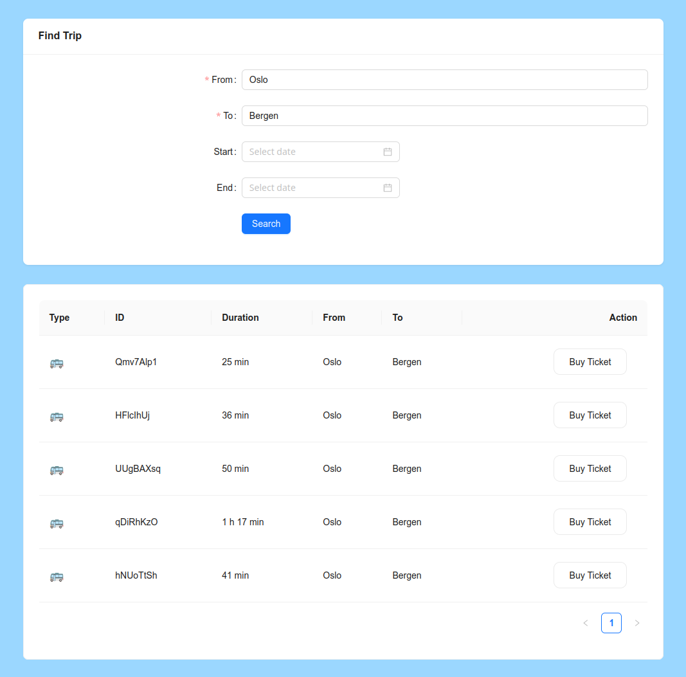

# Next.js webapp

see the hosted [demo](https://ailurus.world/demos/travel-and-ticket)

example webapp using:

- [x] Typescript
- [x] Nextjs 
- [x] Cypress
- [x] Jest
- [x] JSDoc
- [ ] use a nice feedback form (https://github.com/m-abdelwahab/feedback-widget, cut for time)

things used:

- ant design for most of the components (cards, lists, buttons...)
- aws lambda running nodejs to generate trip data (app makes _real_ http requests!)

AWS Lambda as a "serverless" backend will scale "for free", and could easily point to a genuine DB! :)

jsdoc generates html under `jsdoc/index.html`

